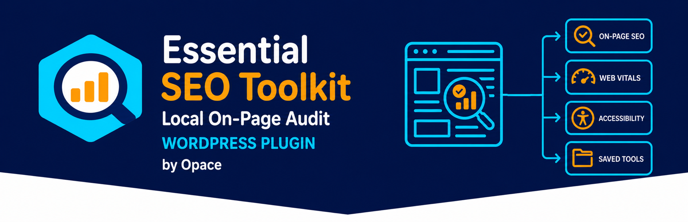
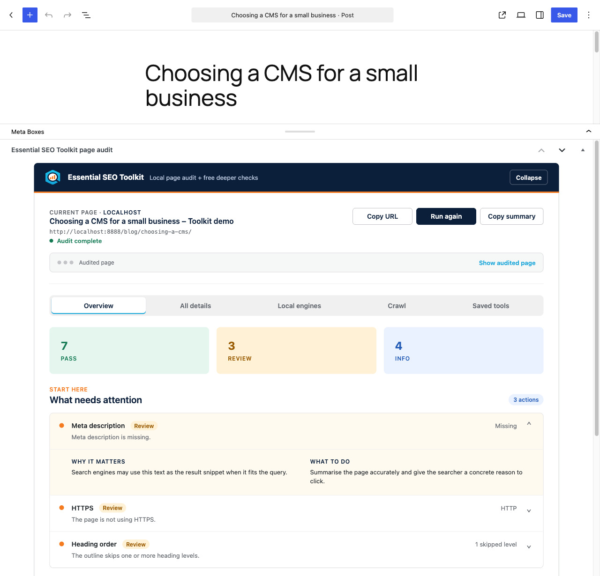
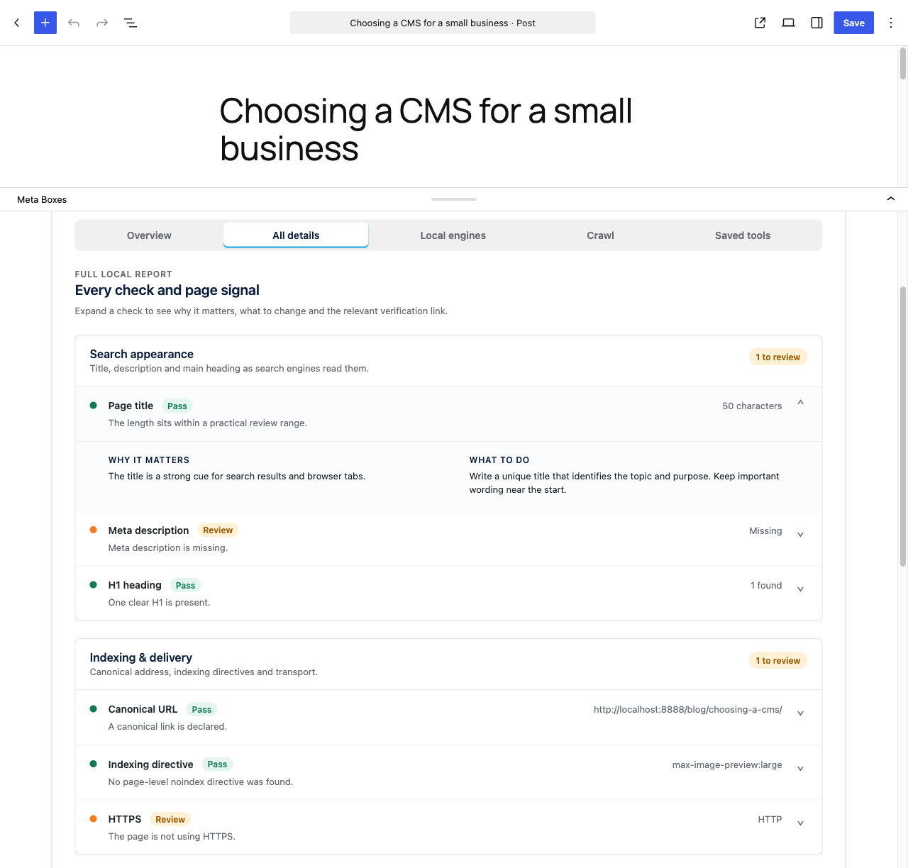
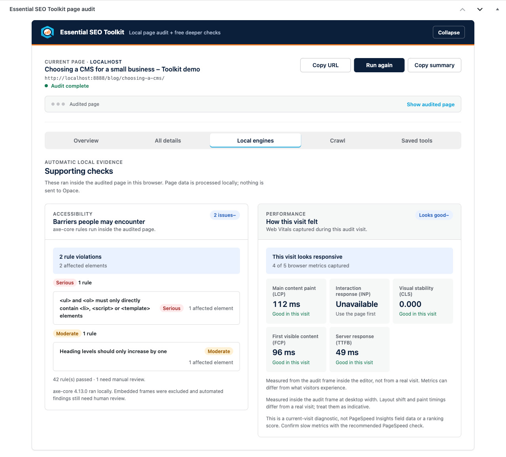
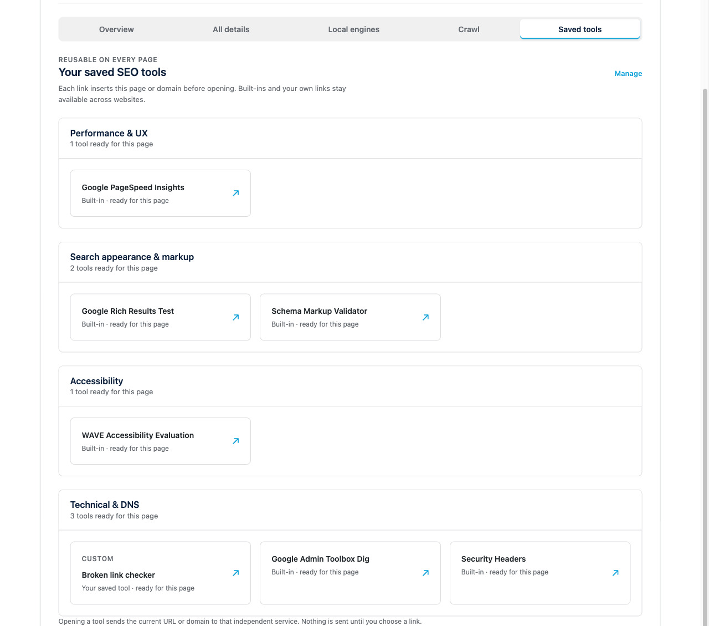
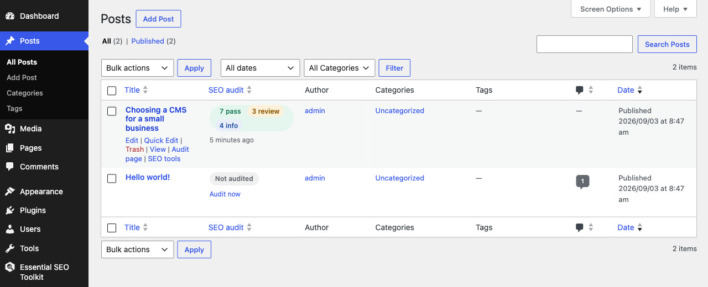
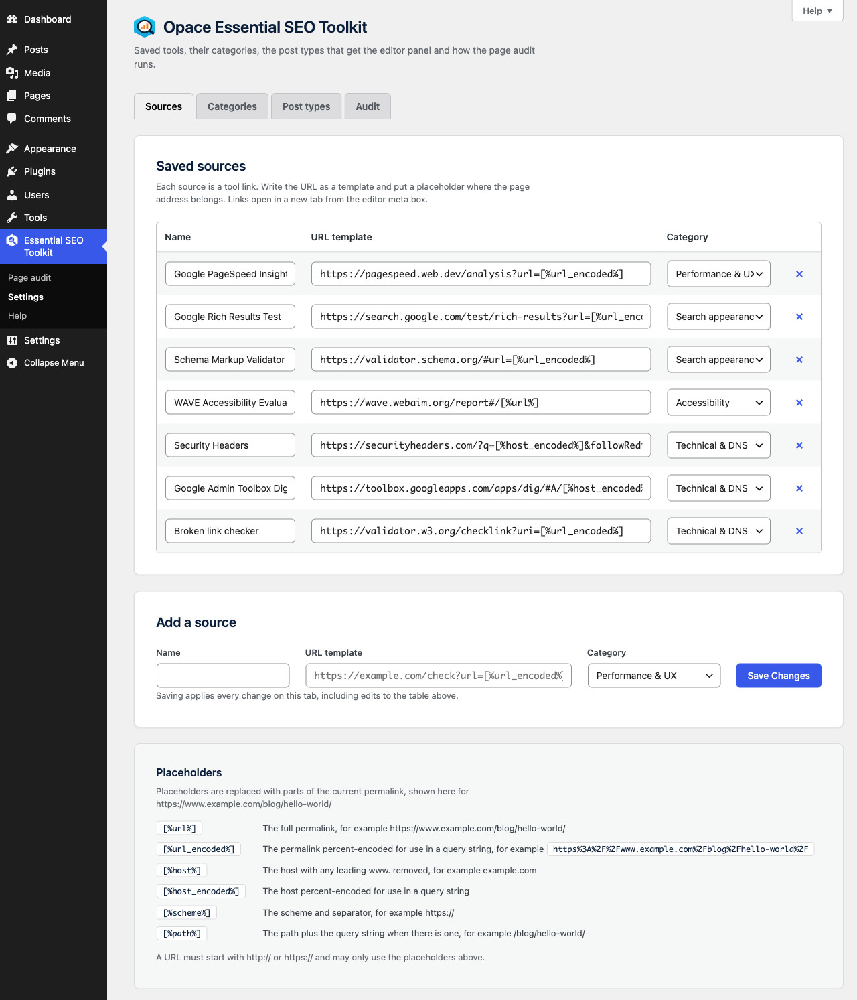

# Opace Essential SEO Toolkit & SEO Audit Tool – WordPress Plugin



[](https://github.com/OpaceDigitalAgency/essential-seo-toolkit-wordpress-plugin/releases/tag/v2.0.0)
[](https://wordpress.org/plugins/opace-essential-seo-toolkit/)
[](https://github.com/OpaceDigitalAgency/essential-seo-toolkit-wordpress-plugin/actions/workflows/quality.yml)
[](LICENSE)

Opace Essential SEO Toolkit & SEO Audit Tool is a private WordPress SEO tool organiser and page-audit system for posts, pages, custom post types, the home page and archives. It turns the page you are editing into a practical on-page SEO review with clear Pass, Review and Info findings.

The audit runs in your browser against your own site. Page content and full results are not sent to Opace or another audit service.

**[Install from WordPress.org](https://wordpress.org/plugins/opace-essential-seo-toolkit/)** · **[Chrome SEO tool](https://chromewebstore.google.com/detail/icagkiolfkmndbggheneeamfbnobcdma)** · **[Opace web design](https://opace.agency/services/web-design/)**

## New in 2.0: rebuilt from a tool launcher into a private page-audit system

Version 2.0 is a major rebuild. Version 1 worked mainly as a page-aware launcher for external SEO tools: a useful alternative to keeping the same SEO bookmarks in your browser.

Version 2 keeps that saved-tool workflow and adds a complete local SEO audit inside WordPress. It checks the page itself, explains what needs attention, runs accessibility and Web Vitals engines, inspects crawl signals and puts recent results wherever editors work. The interface, branding, defaults, settings, help and privacy controls have also been rebuilt.

## WordPress SEO audit with 14 on-page checks

Open a post and select **Run audit**. The page appears in an admin viewer while the audit runs, then the viewer collapses when results are ready. The report uses three plain-language states rather than an unexplained SEO score:

- **Pass**: the common check found nothing to change.
- **Review**: the result deserves a closer look.
- **Info**: a descriptive count or observation with no fixed target.

The on-page SEO audit covers:

- **Search appearance:** page title, meta description and H1 heading.
- **Indexing and delivery:** canonical URL, indexing directive and HTTPS.
- **Content and accessibility:** document language, mobile viewport, image alt attributes, heading order and visible content.
- **Markup and navigation:** structured data, social metadata and internal, external and nofollow links.

Overview prioritises findings. All details explains why each check matters and what to do. Insights includes search and social previews, page structure, top terms and phrases. Copy summary produces a plain-text SEO audit report.

## Accessibility and Web Vitals SEO tools

Two bundled, switchable engines add local evidence:

- **axe-core** reports automated accessibility rule violations and affected elements.
- **Web Vitals** captures LCP, CLS, INP, FCP and TTFB from that audit visit.

These are current-visit diagnostics, not PageSpeed Insights, CrUX field data or ranking evidence. The admin viewer uses a desktop width, so timings can differ from a normal visit. Automated accessibility findings still need human review.

## Technical SEO analysis and crawl signals

The Crawl tab reports status, redirects and response headers. It reads the applicable `robots.txt` rule and discovers sitemaps from `robots.txt`, WordPress core and common sitemap locations. Your WordPress site makes these requests to itself and caches the response for 60 seconds.

## An SEO toolkit across WordPress

- A compact audit card below the block or classic editor expands when an audit runs.
- **Essential SEO Toolkit → Page audit** checks any same-site address, including the home page, archives and pages built by other plugins.
- Post lists show sortable audit results, row actions and a sequential bulk-audit action.
- The admin bar provides **Audit this page** and page-aware saved tools.
- A dashboard widget lists the five most recent audits.
- In-plugin Help documents every check, engine, setting and troubleshooting route.
- Settings control saved sources, categories, post types, automatic auditing, local engines and list-table columns.

## Page-aware SEO bookmarks and saved SEO tools

Saved tools work like SEO bookmarks that already know the current page address. Six free SEO tools ship by default:

- Google PageSpeed Insights
- Google Rich Results Test
- Schema Markup Validator
- WAVE Accessibility Evaluation
- Security Headers
- Google Admin Toolbox Dig

Add, edit or remove links under **Essential SEO Toolkit → Settings**. Templates support `[%url%]`, `[%url_encoded%]`, `[%host%]`, `[%host_encoded%]`, `[%scheme%]` and `[%path%]`.

## Private SEO analysis by design

Nothing loads for ordinary visitors. Audit engines run only when an authorised, logged-in editor requests an audit. Full reports are not stored; WordPress keeps only counts, leading Review labels, captured metrics and audit time for admin summaries.

Deeper checks open independent third-party websites only when selected. That service receives the page address under its own terms. Opace is not affiliated with those services and does not promise rankings or traffic.

## Upgrading from Essential SEO Toolkit 1.x

Version 2.0 replaces the old default list with six current tools and renames default categories. A one-time migration keeps every tool you added or edited and removes only unchanged legacy defaults. Review Settings after updating to choose the post types, audit behaviour and engines you want.

## SEO plugin screenshots

| SEO audit overview | Detailed SEO analysis |
| --- | --- |
|  |  |
| Accessibility and Web Vitals | Page-aware SEO tools |
|  |  |
| Post-list audit results | SEO toolkit settings |
|  |  |

## Requirements and installation

- WordPress 6.0 or later
- PHP 7.4 or later
- Tested through WordPress 7.1 and PHP 8.3

Install the signed release from [WordPress.org](https://wordpress.org/plugins/opace-essential-seo-toolkit/), or upload the ZIP from the matching [GitHub release](https://github.com/OpaceDigitalAgency/essential-seo-toolkit-wordpress-plugin/releases).

## Development, tests and release package

```bash
composer install
npm install
npm run lint:php
npm run test:php:standalone
npm run check:standalone
npm run build
```

The PHPUnit suite contains 185 tests and 1,330 assertions. The release workflow also checks PHP 7.4 syntax and builds a WordPress-ready ZIP. WordPress.org SVN remains the deployment channel; GitHub is the development history and release mirror.

Version `2.0.0` prepared release SHA-256:

```text
f76ece064add6e803158078075f9023bf377ce2c150aad943fcc7036759079e4
```

## Related SEO tools, support and links

- [Opace Essential SEO Toolkit & SEO Audit Tool – Google Chrome Extension](https://github.com/OpaceDigitalAgency/essential-seo-toolkit-chrome-extension)
- [Chrome Web Store listing](https://chromewebstore.google.com/detail/icagkiolfkmndbggheneeamfbnobcdma)
- [WordPress.org support forum](https://wordpress.org/support/plugin/opace-essential-seo-toolkit/)
- [Leave a WordPress.org review](https://wordpress.org/support/plugin/opace-essential-seo-toolkit/reviews/#new-post)
- [Opace tool suites](https://opace.agency/tools/suite/)
- [Opace SEO services](https://opace.agency/services/seo/)
- [Opace WordPress development](https://opace.agency/services/web-design/wordpress-development/)
- [Opace web design](https://opace.agency/services/web-design/)
- [More Opace open-source projects](https://github.com/OpaceDigitalAgency)

## Contributing and security

Focused issues and pull requests are welcome; see [CONTRIBUTING.md](CONTRIBUTING.md). Do not post private URLs, draft content or credentials. Report vulnerabilities privately under [SECURITY.md](SECURITY.md).

## Licence (License)

Copyright © Opace Ltd. Released under [GPL-3.0-or-later](LICENSE). Bundled third-party libraries retain their own licences; see [third-party-notices.txt](third-party-notices.txt).
